# Feature-selection-and-model-creation-for-NBA-2K-rating
## Overview

NBA 2K is a popular basketball video game series. Player ratings in the game represent the virtual skills and abilities of real-life NBA players. My client for this project wanted a model that could be fed a players metrics(eg games played, Total Minutes played, Total Points, Field Goal Percentage, number of shots blocked by the player per game, etc) and compute the player's ratings. The model was to be as simple as possible i.e use as little metrics as possible(as low as five) and get the most accurate rating. The model was to be used in a Basketball Academy to identify the player's rating and form over time. The model was to be used primarily on Fowards.

## Data
The players' data came from [NBA official site](https://www.nba.com/stats/players/traditional?PlayerExperience=Veteran&PlayerPosition=F&dir=A&sort=PLUS_MINUS). The data contained every NBA player's stats for various metrics.  
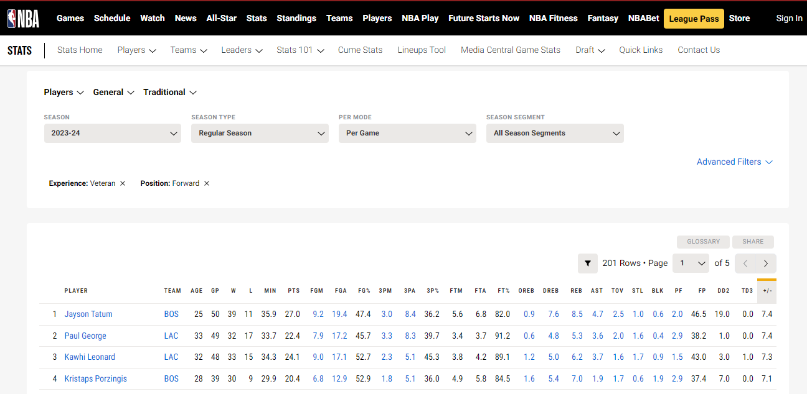  
I downloaded the data to an excel file, cleaned the data by removing the metrics that were unavailable to my client, and added a column for each player's respective 2K rating. This is what the columns represented:
* PLAYER: Represents the name of the NBA player.
* 2K Overall: Indicates the player's overall rating in the NBA 2K video game, which is a comprehensive assessment of their skills and abilities.
* GP (Games Played): Represents the total number of games the player has participated in.
* MIN (Minutes per Game): Denotes the average number of minutes the player spends on the court per game.
* PTS (Points per Game): Reflects the average number of points the player scores per game.
* FG% (Field Goal Percentage): Represents the player's shooting efficiency by indicating the percentage of successful field goals made.
* 3P% (Three-Point Percentage): Indicates the player's accuracy in making three-point shots, presented as a percentage.
* FT% (Free Throw Percentage): Represents the player's accuracy in free throw shooting, presented as a percentage.
* REB (Rebounds per Game): Denotes the average number of rebounds (both offensive and defensive) the player secures per game.
* AST (Assists per Game): Represents the average number of assists the player records per game, showcasing their playmaking ability.
* STL (Steals per Game): Indicates the average number of steals the player achieves per game, showcasing defensive prowess.
* BLK (Blocks per Game): Denotes the average number of shots blocked by the player per game, indicating rim protection.
* DD2 (Double-Doubles): Represents the number of games in which the player has achieved a double-double, meaning double digits in two statistical categories (e.g., points and rebounds).

  
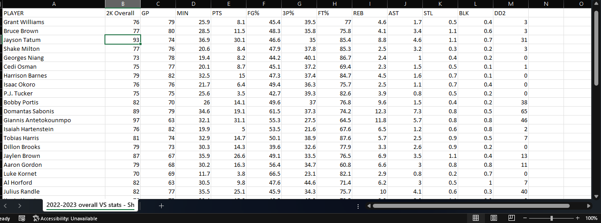  
This data was now ready for feature selection analysis and model development

## Recursive feature elimination (RFE) and Machine Learning model development
### Data cleaning and EDA
The Recursive Feature Elimination technique was applied using Python within a Jupyter notebook environment. RFE, a systematic approach to feature selection, iteratively assesses and removes less influential features, contributing to the refinement and optimization of the model.
I began by importing all required modules and models  
  
I read in the data from the Excel file to a Pandas DataFrame  
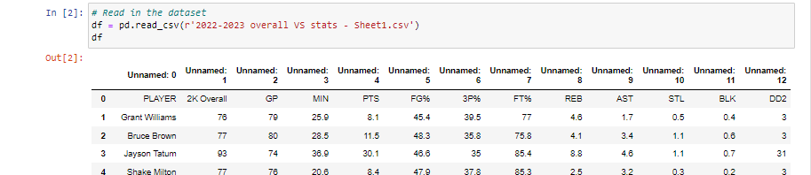  
I proceeded to clean the dataframe by setting the column names right and setting the correct datatype for each column  
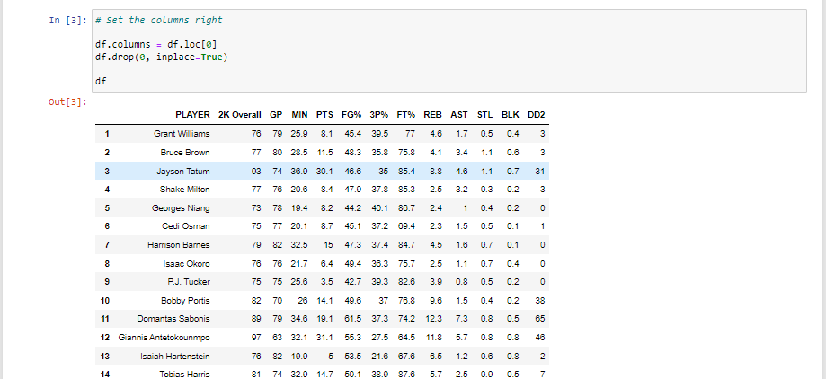  
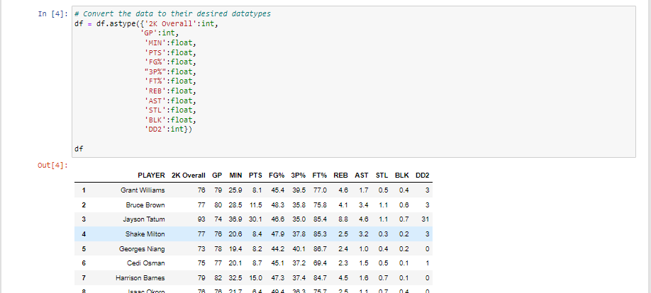  
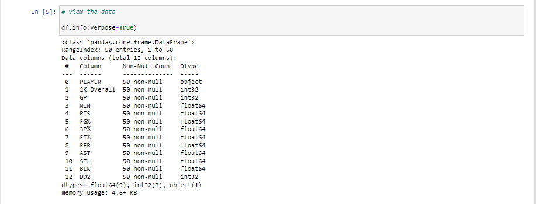  

I created a correlation matrix to identify the metrics that had a high correlation with the 2K rating. Points and assists had the highest correlation. There were also metrics that had a very high correlation with each other. There was also very low correlation between 2K Overall and GP, FG%, P%, and the lowest being FT%  
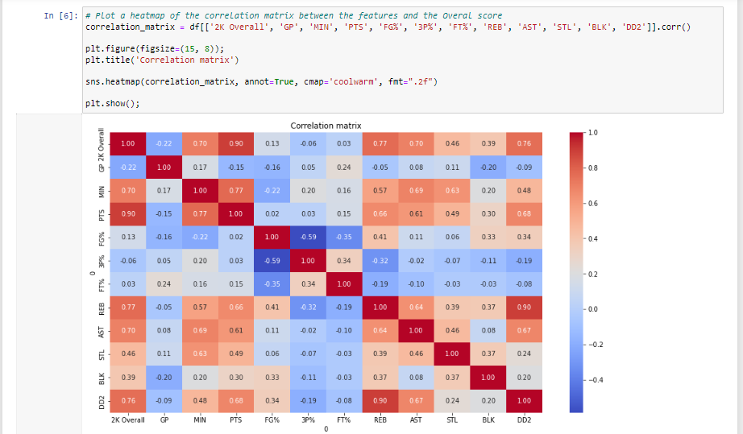  
I then ranked the metrics correlation with the 2K rating  
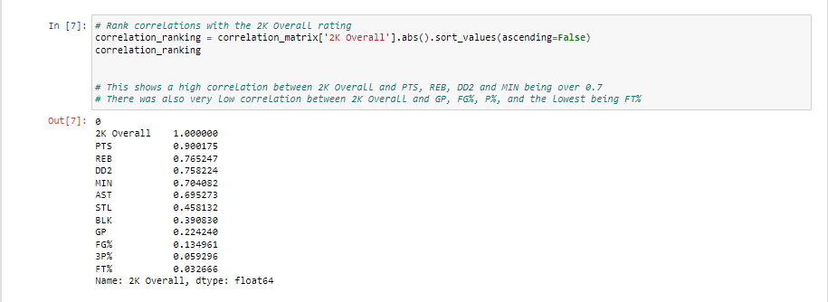  

### Model selection
Before using Recursive Feature Elimination to determine the most important metrics, I tested multiple models and selected the one that had the highest accuracy(R-squared) and lowest Mean_squared error for the best results.  
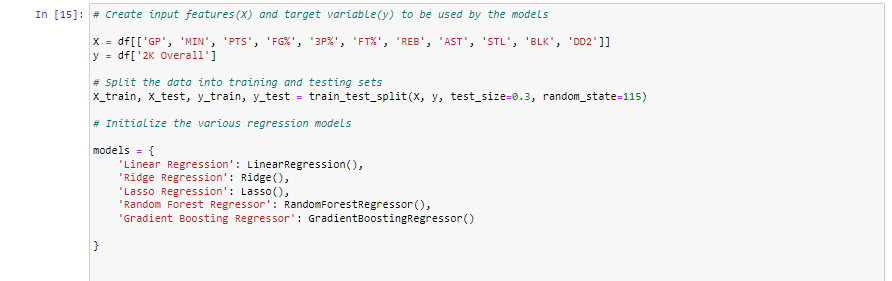  
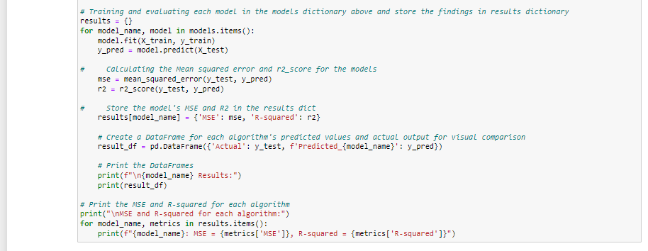 
Output:  
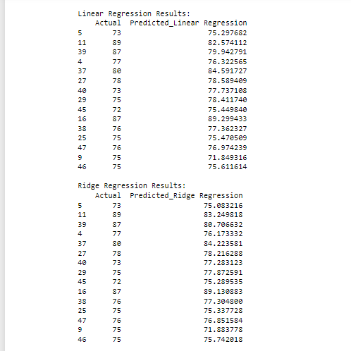  
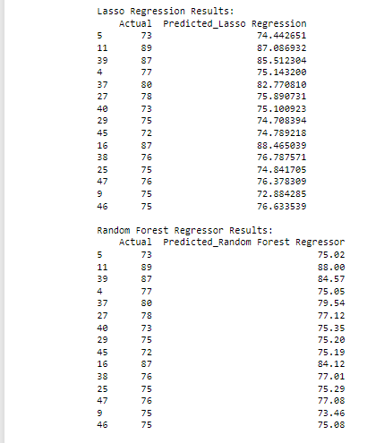  
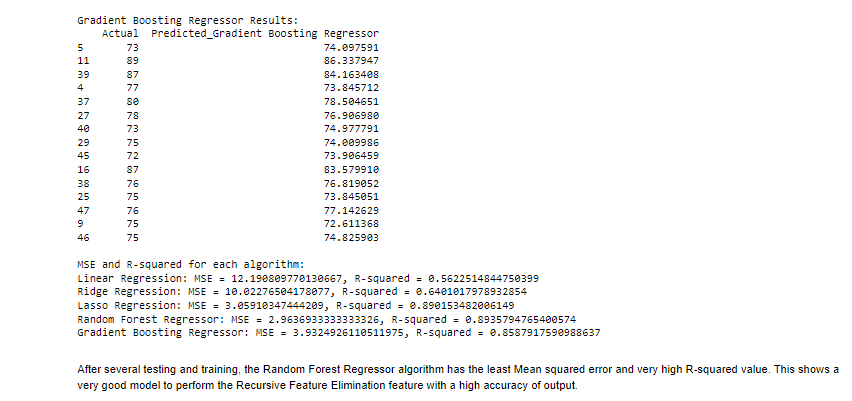  

I proceeded to perform RFE on the Random Forest Regressor model that was the most accurate of all the models trained and tested with the data  
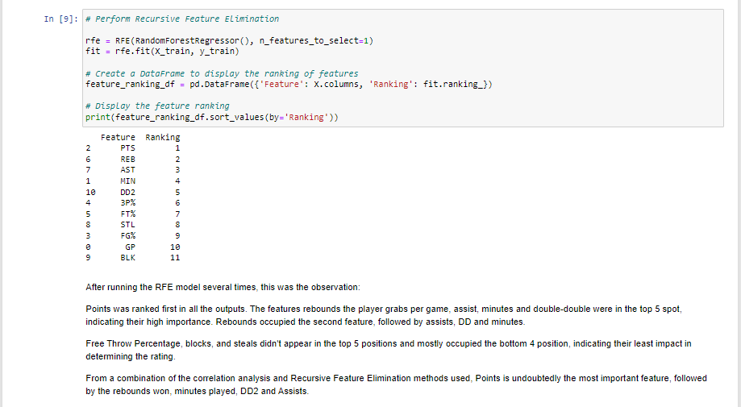  
I created another Random Forest Regression model that only used the top 5 metrics only. I then saved the the two models as pickle file. I proceeded to create two functions that my client would use to get the rating of his players;
The first function used all the metrics to get the rating while the second function used only the top five metrics to get the rating. The two models had a very high accuracy.  
First function(All metrics) 
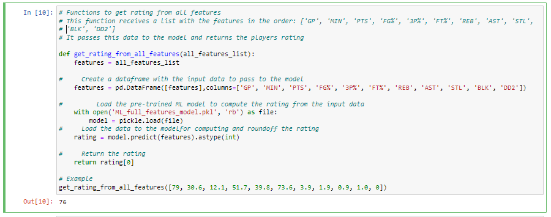  
Second function(Only top 5 metrics) 
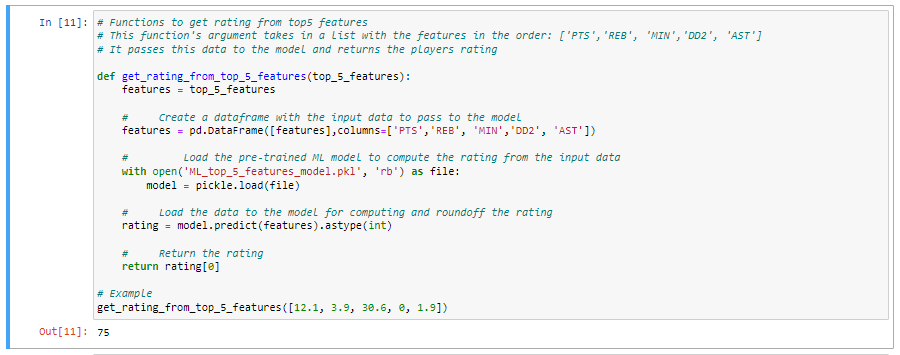  

This project successfully leveraged Recursive Feature Elimination (RFE) to identify the most influential metrics for predicting the rating of basketball players. By employing a Random Forest Regressor model, the top five features were determined, providing a streamlined and efficient approach for assessing player performance for my client's Basketball Academy. This refined model not only enhances the accuracy of player ratings but also offers valuable insights for optimizing training strategies and talent development initiatives. The integration of RFE and Machine Learning stands as a robust methodology, contributing to the data-driven decision-making processes crucial for elevating the standards of the Basketball Academy.
